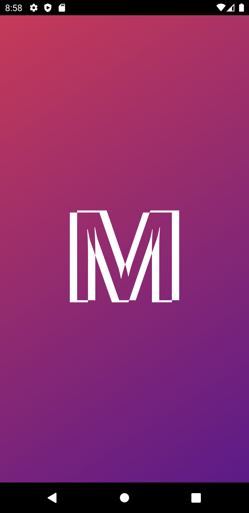
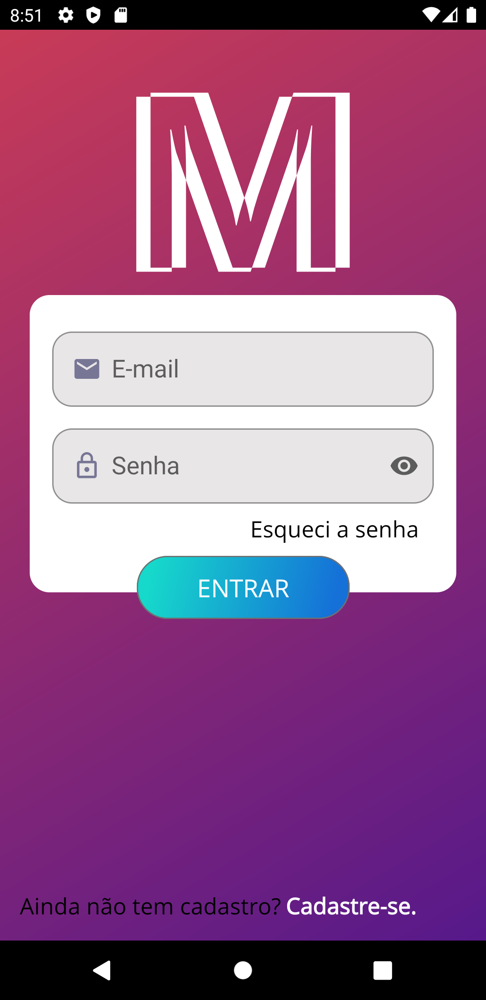
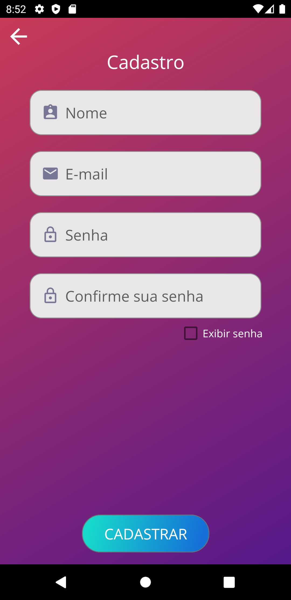
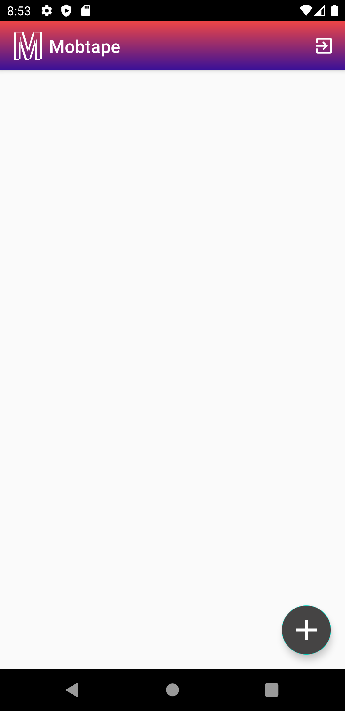
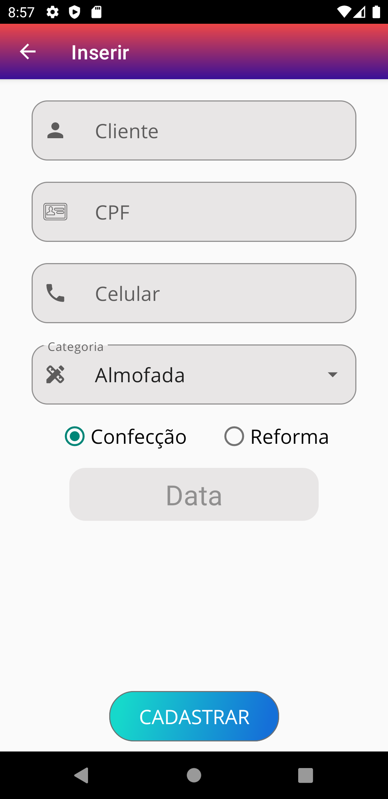
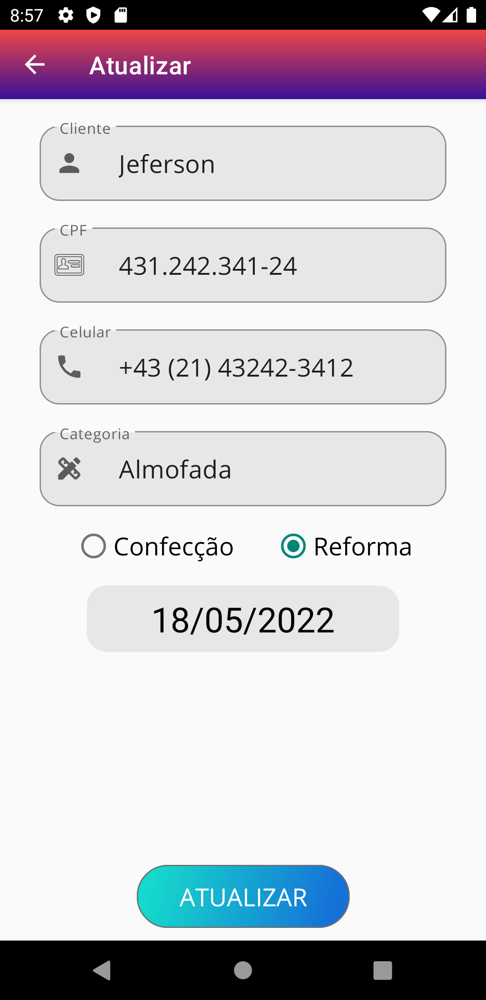

# Mobtape App

Project created for university internship

## Screenshots

    
    
    

    
    
    

## Development Roadmap

- Room
- Retrofit
- MVVM Architecture
- DevMasterTeam API

## Authors

- [@jefersoncoutinho](https://github.com/jefisu)
